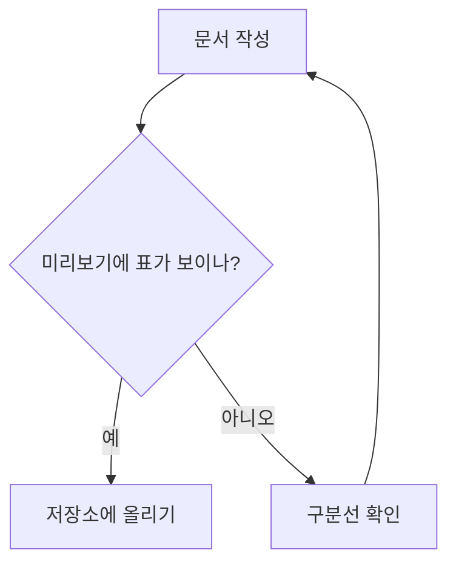

# md-lab — 마크다운 문서 작성 실습 저장소

**마크다운 문서 작성**(MD-101) 과정의 차시별 실습 결과물을 모아 둔 **공개 데모 저장소**입니다.
훈련생은 자기 저장소를 따로 만들어 같은 순서로 채워 나가고, 막힐 때 이 저장소를 열어 비교합니다.

> [!NOTE]
> 이 저장소의 목적은 **GitHub 에서 실제로 어떻게 보이는지** 확인하는 것입니다.
> 각주 · 알림 상자 · Mermaid 다이어그램은 **편집기 미리보기에서는 보이지 않을 수 있지만**
> GitHub 에서는 아래처럼 제대로 렌더링됩니다.

## 차시별 실습

| 차시 | 주제 | 폴더 |
|:---|:---|:---|
| 01 | 문서화의 가치·작성 환경 구축 | [day01](day01/) |
| 02 | 기본 문법 ① 제목·강조·목록 | [day02](day02/) |
| 03 | 기본 문법 ② 링크·이미지·코드 | [day03](day03/) |
| 04 | 표·체크리스트·각주 | [day04](day04/) |
| 05 | GFM 확장과 렌더러 차이 | [day05](day05/) |
| 06 | 문서 구조 설계 | [day06](day06/) |
| 07 | Mermaid ① 흐름도 | [day07](day07/) |
| 08 | Mermaid ② 시퀀스·ER | [day08](day08/) |
| 09 | Mermaid ③ 간트·상태도 | [day09](day09/) |
| 10 | 이미지·스크린샷 자산 관리 | [day10](day10/) |

## 편집기에서 안 보이던 것들

### 각주 (04차시)

마크다운 표준은 CommonMark[^1] 이고, GitHub 은 여기에 표와 취소선을 더한 GFM[^gfm] 을 씁니다.

[^1]: https://commonmark.org — 2014년에 나온 엄밀한 규격
[^gfm]: GitHub Flavored Markdown. 표·취소선·작업 목록을 추가한다

### 알림 상자 (05차시)

> [!TIP]
> 표는 `Shift+Alt+F` 로 한 번에 정렬됩니다.

> [!WARNING]
> 절대 경로로 이미지를 넣으면 다른 PC에서 깨집니다.

### Mermaid 흐름도 (07차시)

### 작업 목록 (04차시)

- [x] 편집기에서 문서를 쓴다
- [x] 저장소에 올린다
- [ ] GitHub 에서 열어 확인한다

## 확인하는 법

1. 폴더를 눌러 `.md` 파일을 엽니다 — GitHub 이 **자동으로 렌더링**해 보여 줍니다
2. 오른쪽 위 **Code** 버튼을 누르면 **원본 글자**를 볼 수 있습니다
3. 같은 파일을 편집기 미리보기에서도 열어 **무엇이 다른지** 비교합니다

---

&copy; 2026 코리아아이티아카데미 · 교육용 예제
