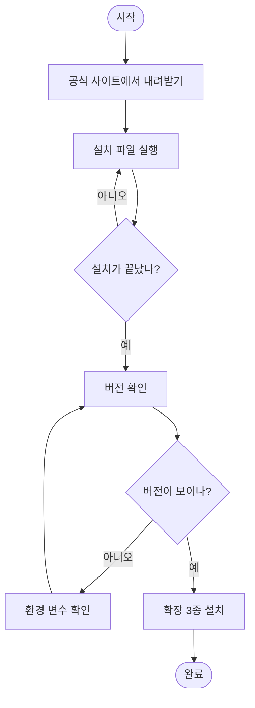

# 개발환경 설치 절차

아래 순서대로 진행합니다. 버전 확인에서 막히면 다시 설치합니다.

```mermaid
flowchart TD
    S([시작]) --> A[공식 사이트에서 내려받기]
    A --> B[설치 파일 실행]
    B --> C{설치가 끝났나?}
    C -- 아니오 --> B
    C -- 예 --> D[버전 확인]
    D --> E{버전이 보이나?}
    E -- 아니오 --> F[환경 변수 확인]
    F --> D
    E -- 예 --> G[확장 3종 설치]
    G --> T([완료])
```

## 확인 사항

- 설치 후 반드시 버전을 확인합니다
- 버전이 안 보이면 환경 변수를 봅니다
