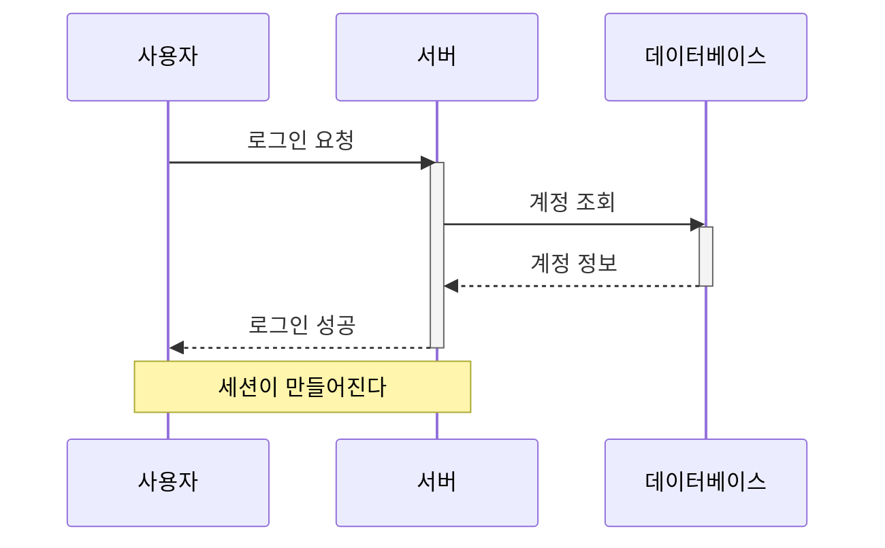

# 활성 구간과 비고

```mermaid
sequenceDiagram
    participant U as 사용자
    participant S as 서버
    participant D as 데이터베이스
    U->>S: 로그인 요청
    activate S
    S->>D: 계정 조회
    activate D
    D-->>S: 계정 정보
    deactivate D
    S-->>U: 로그인 성공
    deactivate S
    Note over U,S: 세션이 만들어진다
```
