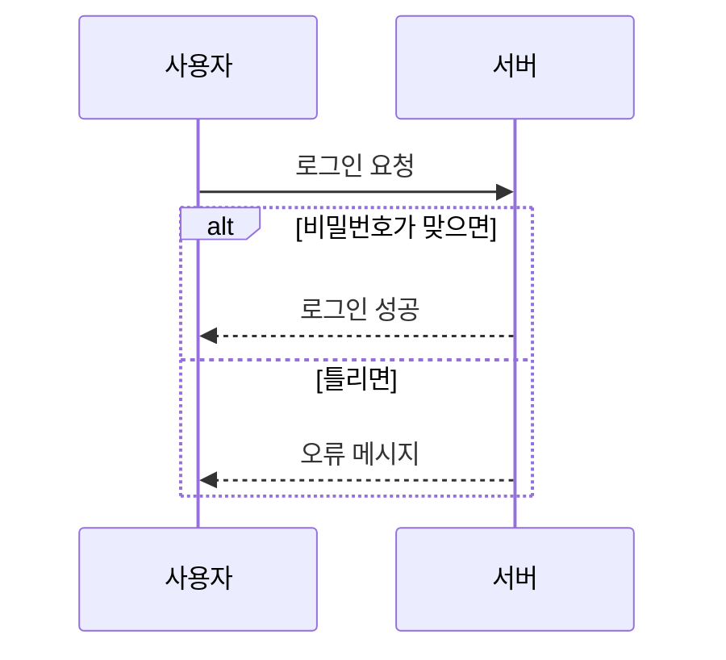

# 조건에 따라 갈릴 때

```mermaid
sequenceDiagram
    participant U as 사용자
    participant S as 서버
    U->>S: 로그인 요청
    alt 비밀번호가 맞으면
        S-->>U: 로그인 성공
    else 틀리면
        S-->>U: 오류 메시지
    end
```
