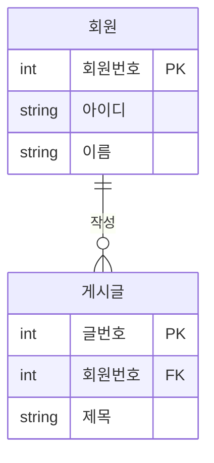

# 속성까지 적기

```mermaid
erDiagram
    회원 {
        int 회원번호 PK
        string 아이디
        string 이름
    }
    게시글 {
        int 글번호 PK
        int 회원번호 FK
        string 제목
    }
    회원 ||--o{ 게시글 : 작성
```
