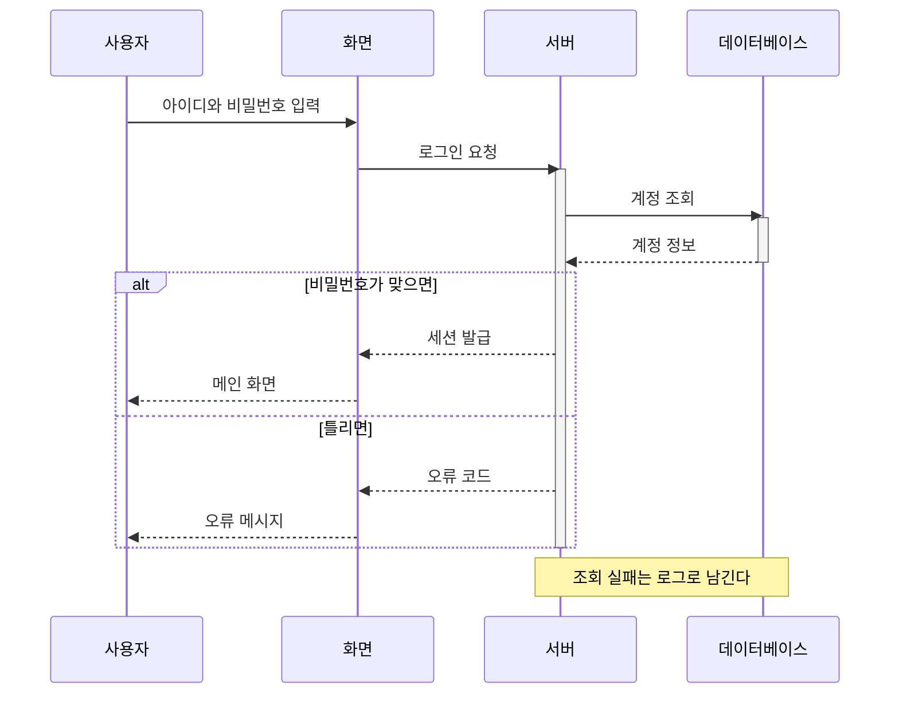

# 로그인 처리 시퀀스

사용자가 로그인 버튼을 누른 뒤 세션이 만들어지기까지의 흐름입니다.

```mermaid
sequenceDiagram
    participant U as 사용자
    participant V as 화면
    participant S as 서버
    participant D as 데이터베이스
    U->>V: 아이디와 비밀번호 입력
    V->>S: 로그인 요청
    activate S
    S->>D: 계정 조회
    activate D
    D-->>S: 계정 정보
    deactivate D
    alt 비밀번호가 맞으면
        S-->>V: 세션 발급
        V-->>U: 메인 화면
    else 틀리면
        S-->>V: 오류 코드
        V-->>U: 오류 메시지
    end
    deactivate S
    Note over S,D: 조회 실패는 로그로 남긴다
```

## 확인 사항

- 참여자는 왼쪽부터 사용자에 가까운 순서로 둡니다
- 응답은 점선 화살표로 그립니다
