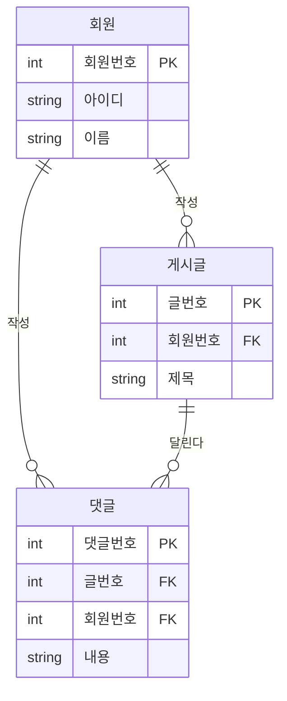

# 게시판 ER 다이어그램

```mermaid
erDiagram
    회원 {
        int 회원번호 PK
        string 아이디
        string 이름
    }
    게시글 {
        int 글번호 PK
        int 회원번호 FK
        string 제목
    }
    댓글 {
        int 댓글번호 PK
        int 글번호 FK
        int 회원번호 FK
        string 내용
    }
    회원 ||--o{ 게시글 : 작성
    회원 ||--o{ 댓글 : 작성
    게시글 ||--o{ 댓글 : 달린다
```

## 확인 사항

- 한 회원은 게시글을 여러 개 쓸 수 있습니다
- 게시글 하나에 댓글이 여러 개 달립니다
