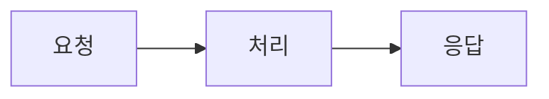
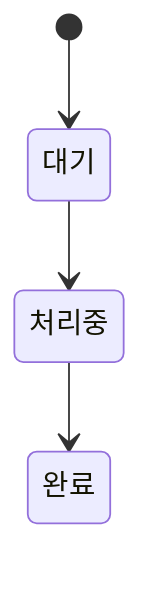

# 설계 개요

## 요청 처리 흐름

요청은 아래 세 단계를 거칩니다.

**그림 1.** 요청 처리 흐름 — 처리 단계에서 실패하면 응답 단계로 가지 않습니다.

처리 단계가 가장 오래 걸리므로 이 구간의 시간을 따로 잽니다.

## 작업 상태

작업 하나는 아래 세 상태를 지납니다.

**그림 2.** 작업 상태 전이 — 되돌아가는 전이는 없습니다.

상태가 되돌아가지 않으므로 완료된 작업은 다시 처리하지 않습니다.
