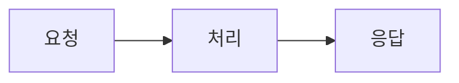
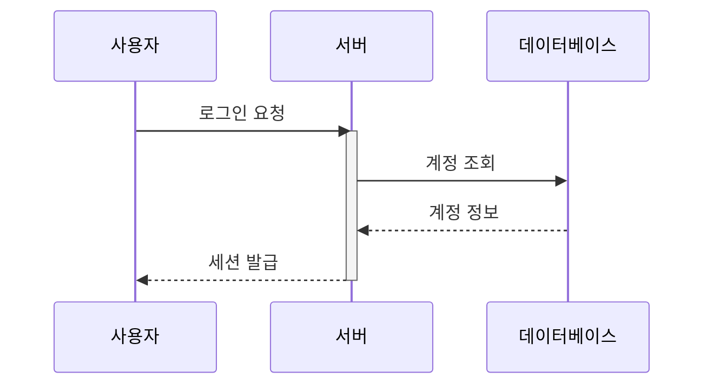
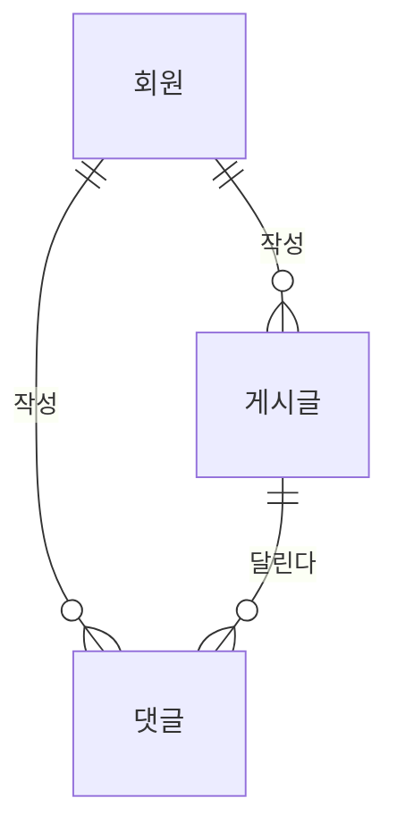
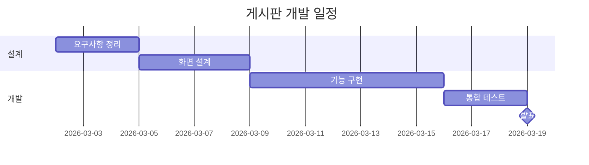
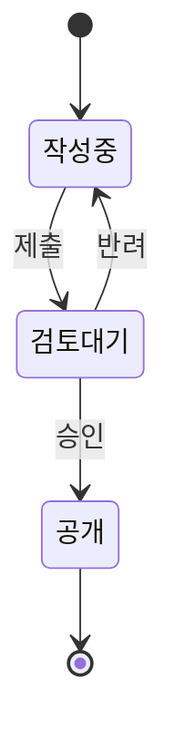

# 게시판 프로젝트 설계 문서

작성자: 홍길동 · 갱신: 2026-09-17

## 목차

- [요청 처리 흐름](#요청-처리-흐름)
- [로그인 처리 순서](#로그인-처리-순서)
- [데이터 구조](#데이터-구조)
- [진행 일정](#진행-일정)
- [글 상태](#글-상태)

## 요청 처리 흐름

모든 요청은 아래 세 단계를 거칩니다.

**그림 1.** 요청 처리 흐름 — 처리 단계에서 실패하면 응답 단계로 가지 않습니다.

처리 단계가 가장 오래 걸리므로 이 구간의 시간을 따로 잽니다.

## 로그인 처리 순서

사용자가 로그인 버튼을 누른 뒤 세션이 만들어지기까지의 흐름입니다.

**그림 2.** 로그인 시퀀스 — 서버는 조회가 끝날 때까지 요청을 붙잡고 있습니다.

서버의 활성 구간이 길어지면 동시 접속에 약해지므로 이 구간을 먼저 봅니다.

## 데이터 구조

회원·게시글·댓글 세 표를 씁니다.

**그림 3.** 게시판 ER — 댓글은 게시글과 회원 양쪽을 가리킵니다.

댓글에 외래키가 둘이므로 글을 지울 때 댓글 처리를 먼저 정해야 합니다.

## 진행 일정

3주 안에 마칩니다.

**그림 4.** 개발 일정 — 화면 설계가 끝나야 기능 구현을 시작합니다.

설계가 하루 밀리면 발표도 하루 밀리므로 설계 구간을 가장 먼저 지킵니다.

## 글 상태

작성한 글은 아래 상태를 지납니다.

**그림 5.** 글 상태 전이 — 반려되면 작성중으로 되돌아갑니다.

되돌아가는 전이가 있으므로 이력을 남겨야 몇 번 반려됐는지 알 수 있습니다.
