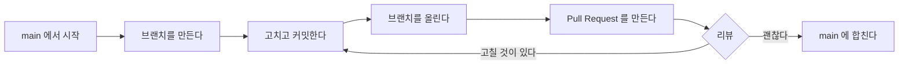

# 리뷰가 있는 팀의 작업 흐름

```mermaid
flowchart LR
    A[main 에서 시작] --> B[브랜치를 만든다]
    B --> C[고치고 커밋한다]
    C --> D[브랜치를 올린다]
    D --> E[Pull Request 를 만든다]
    E --> F{리뷰}
    F -- 고칠 것이 있다 --> C
    F -- 괜찮다 --> G[main 에 합친다]
```

## 확인 사항

- 혼자 고칠 때도 브랜치를 쓰면 main 은 늘 정상 상태로 남는다
- 리뷰에서 고칠 것이 나오면 같은 브랜치에 커밋을 더한다
