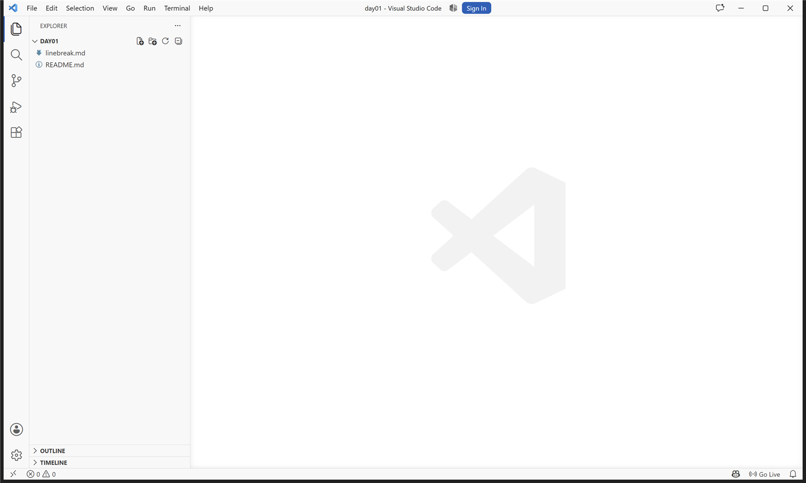
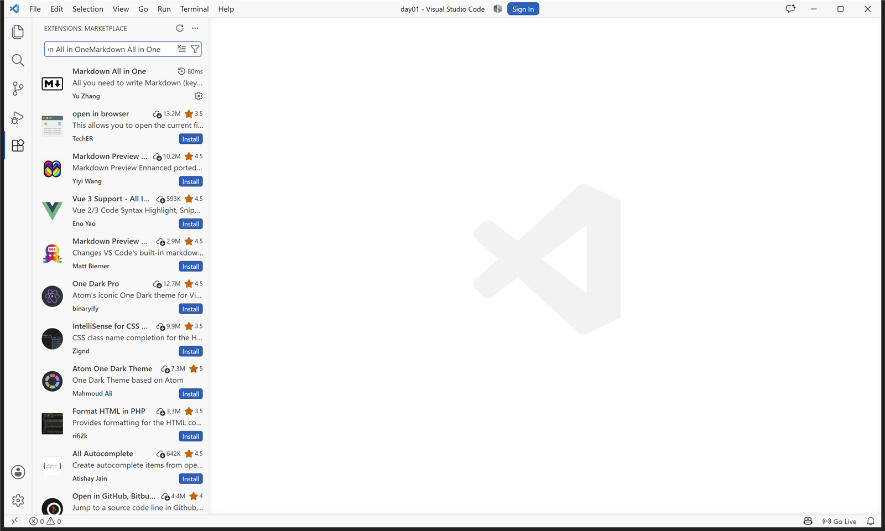
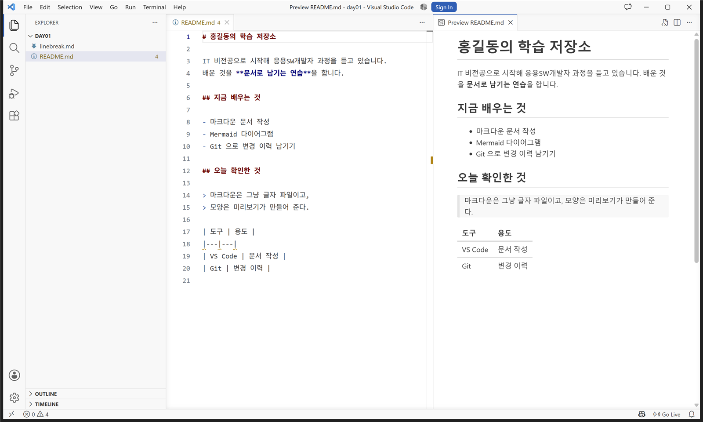

# VS Code 설치 매뉴얼

## 1. 개요

이 문서는 **Visual Studio Code** 를 처음 설치하고 마크다운을 쓸 수 있는 상태까지 만드는 절차를 설명합니다.
프로그램을 한 번도 설치해 본 적이 없어도 **그대로 따라 하면** 됩니다.

## 2. 설치 파일

| 항목 | 내용 |
|:---|:---|
| 이름 | Visual Studio Code |
| 내려받는 곳 | 공식 사이트의 Download 단추 |
| 파일 종류 | Windows 설치 파일 (`.exe`) |

## 3. 설치 환경

| 항목 | 요구 사항 |
|:---|:---|
| 운영체제 | Windows 10 이상 |
| 디스크 여유 공간 | 500MB 이상 |
| 인터넷 | 내려받기와 확장 설치에 필요 |

## 4. 설치 절차

### 4-1. 설치하고 처음 실행합니다

설치가 끝나면 프로그램이 자동으로 열립니다.

**그림 1.** 첫 실행 — 이 화면이 보이면 설치가 끝난 것입니다.

### 4-2. 마크다운 확장을 설치합니다

왼쪽 세로 줄에서 **확장** 아이콘을 누르고 `Markdown All in One` 을 검색해 설치합니다.

**그림 2.** 확장 설치 — 설치가 끝나면 단추가 **톱니 모양**으로 바뀝니다.

### 4-3. 미리보기가 되는지 확인합니다

마크다운 파일을 열고 **Ctrl+K** 를 누른 뒤 **V** 를 누르면 오른쪽에 미리보기가 열립니다.

**그림 3.** 미리보기 — 왼쪽 글자가 오른쪽에서 **서식**으로 보이면 성공입니다.

## 5. 삭제 방법

**설정 → 앱 → 설치된 앱** 에서 `Visual Studio Code` 를 찾아 **제거**를 누릅니다.
설정 파일은 남으므로, 완전히 지우려면 사용자 폴더의 `.vscode` 폴더도 함께 지웁니다.

## 6. 버전

| 항목 | 값 |
|:---|:---|
| 문서 버전 | 1.0.0 |
| 대상 프로그램 | Visual Studio Code |
| 최종 갱신 | 2026-09-17 |

## 7. 작성자

홍길동 · 마크다운 문서 작성 과정

## 8. 자주 묻는 질문

**Q. 확장을 검색해도 안 나옵니다.**
A. 인터넷 연결을 확인하세요. 사내망이면 마켓플레이스가 막혀 있을 수 있습니다.

**Q. 미리보기 단축키가 안 먹습니다.**
A. **Ctrl+K 를 먼저 떼고** V 를 누릅니다. 두 키를 동시에 누르는 것이 아닙니다.

**Q. 한글이 깨져 보입니다.**
A. 파일을 다시 저장할 때 인코딩을 **UTF-8** 로 지정합니다.
